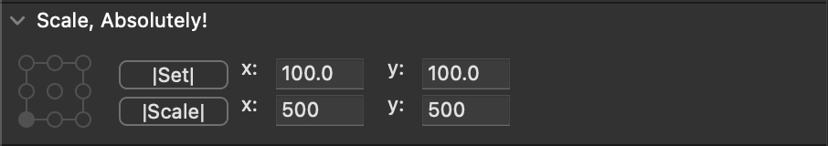

# Scale, absolutely!
A RoboFont extension to scale points, absolutely!
- it adds option to Inspector, where you can choose if you wish to scale absolutely or not.
- it saves state of your latest option, so you don't have to always set it with opening a new inspector. 
- it supports mathematical operations and vertical alignment variables

## plans
- live transform will show absolute values as well
- input window will support math operations and variable of vertical metrics. Thanks, Renan!
- shortcuts for scaling in both directions on both axes

## syntax
- `200` sets current selection to 200
- `+20` adds 20 units to current dimension
- `+20/2` adds 20 divided by two to current dimension
- `a` sets current dimension to value of ascender, counted from baseline
- `A` sets current dimension to value of ascender's blue zone, counted from baseline
- `A+B` sets current dimension to value of ascender's blue zone + baselines's blue zone
- `A+D` sets current dimension to value of ascenders's blue zone + descender's blue zone. This will result into scaling that goes from baseline blue zone to ascender's blue zone

NOTE: Blue zones must be set for given font if you desire to use this syntax. If no blue zones are set, then`A = a`.

## history of versions
- 0.3 - extension now has memory for inputs of absolute and relative scaling. Scale absolutely, go relative and then back to absolute and your values are loaded back. When you are scaling a contour, the extension shows absolute width and height in current scale transformation settings, the same as you scale in relative mode.
- 0.2 - bug fix, wrong plist
- 0.1 - initial version

For the absolute scalers :)
